# Лабораторная работа по ТКРПП

Команда:
- Поважный Виталий Евгеньевич РИС-22-1б
- Карнаухов Михаил Евгеньевич РИС-22-1б
- Вышенская Екатерина Игоревна РИС-22-1б
- Зырянов Ростислав Александрович РИС-22-1б

# Пайплайны

Изначально джобы: чек-стайл, билд, тест и паблиш - были в одном пайплайне и срабатывали каждый раз при создании/коммите пулл-реквеста.

Решили их разделить на дев и меин пулл-реквесты. "Чек-стайл" остался в девелоп бранче, так как он там нужнее. Из меина его вырезали, так как он и так проходит в бранче дев.

Из бранча дев всё объединяется в меин, когда готова новая версия приложения, следовательно, джоб "паблиш" только в меин пайпе.

Вывод участников команды происходит в джобе "check-style" на стадии "Run PR size check script" через питон скрипт в __Develop Merge CI Pipeline__

А также в джобе "build" на стадии "Run the application" вывод приложения

# Отчёт

__- Виталий__
1. Добавил всех участников команды в коллабораторы
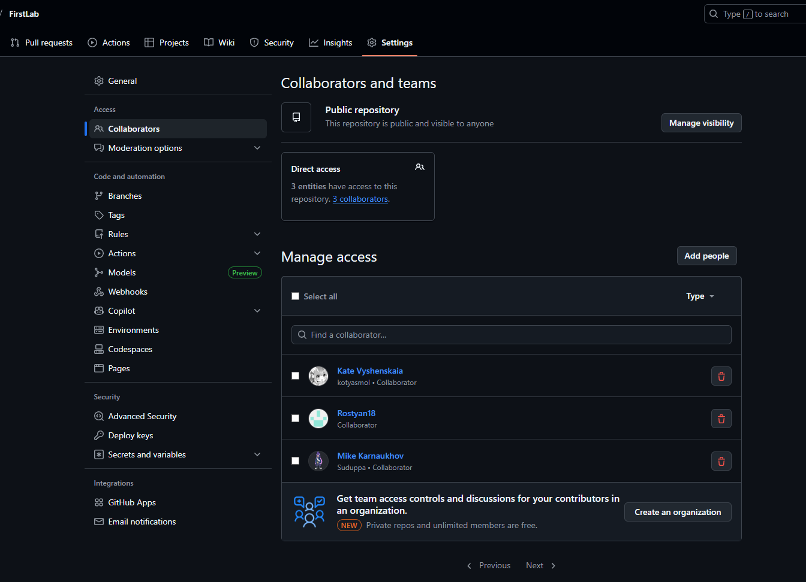

2. Добавил пайпы для тестирования только билдов и простой вывод в консоли
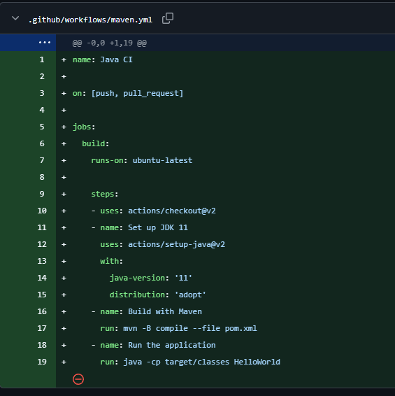
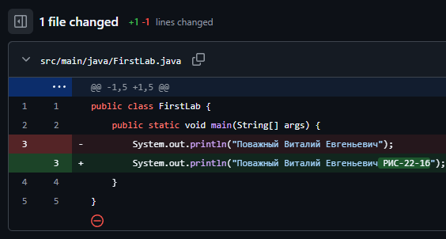

3. Добавил тесты, обновил пайпы и добавил бранч develop и разделил работу по бранчам feature, bugs и refactor
например текущее изменение было в бранче: feature/add-test
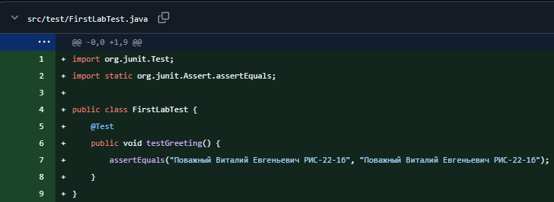

4. Создал и завершил пулл-реквест
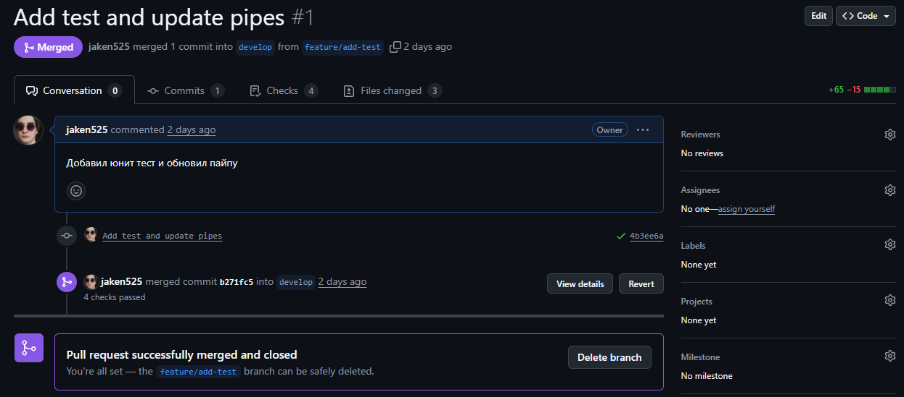

____
__- Ростислав__
1. Добавил checkstyle 
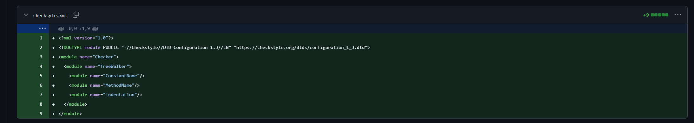

2. Добавил себя в мейн и исправил тесты
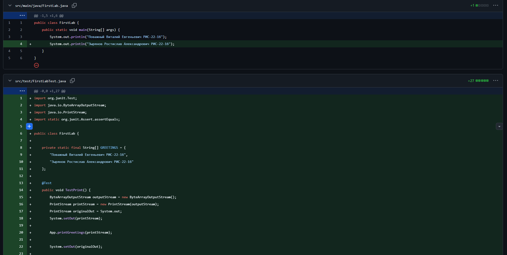

3. Создал и завершил пулл-реквест
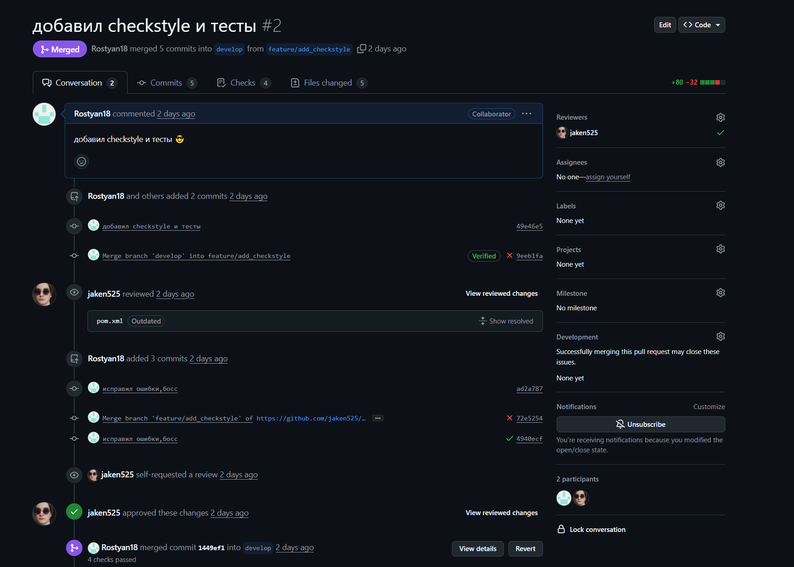

____
__- Михаил__
1. Добавил себя в main и поправил тесты
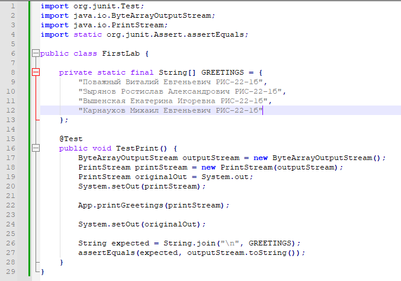
2. Создал и завершил пулреквест
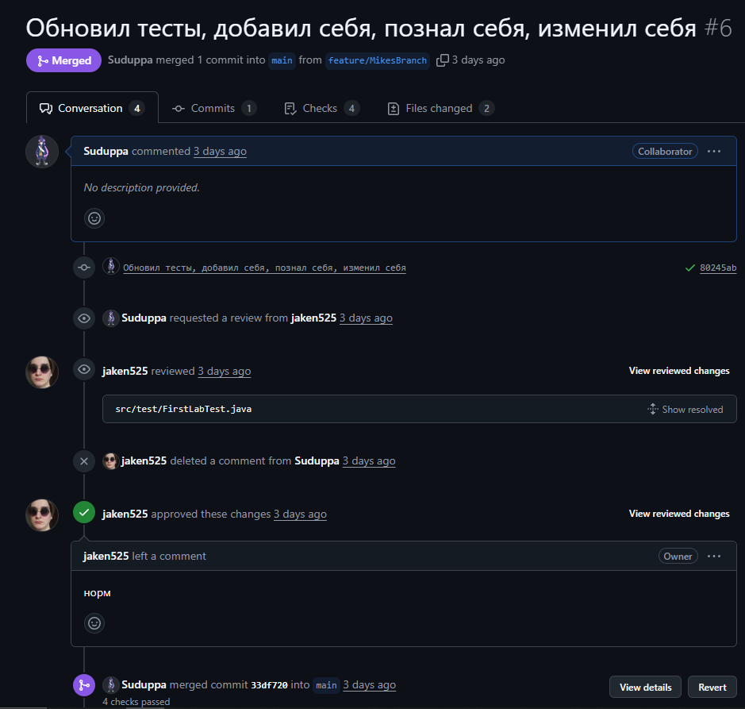

____
__- Катя__
1. Добавила .py скрипт  
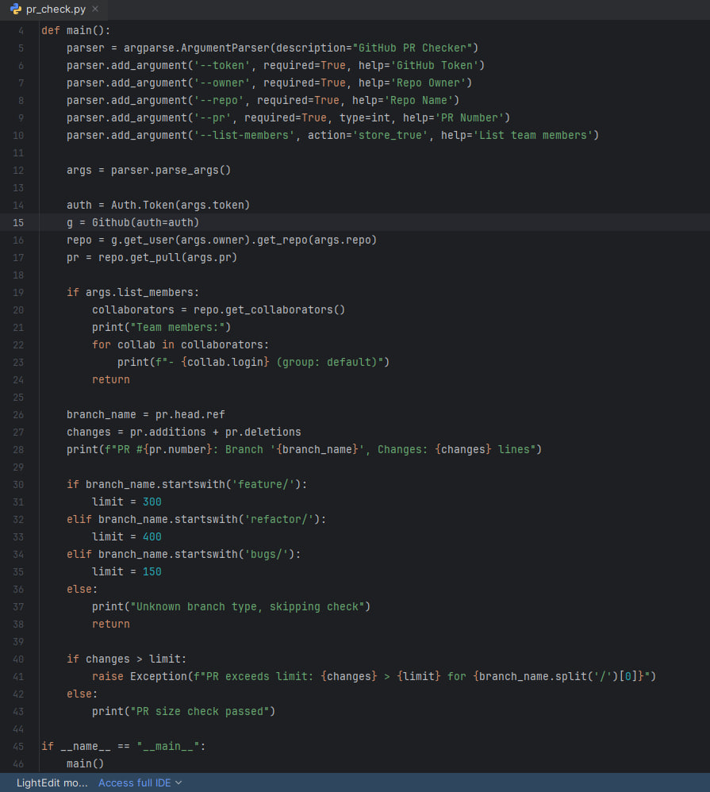

2. Добавила себя в мейн и исправила тесты
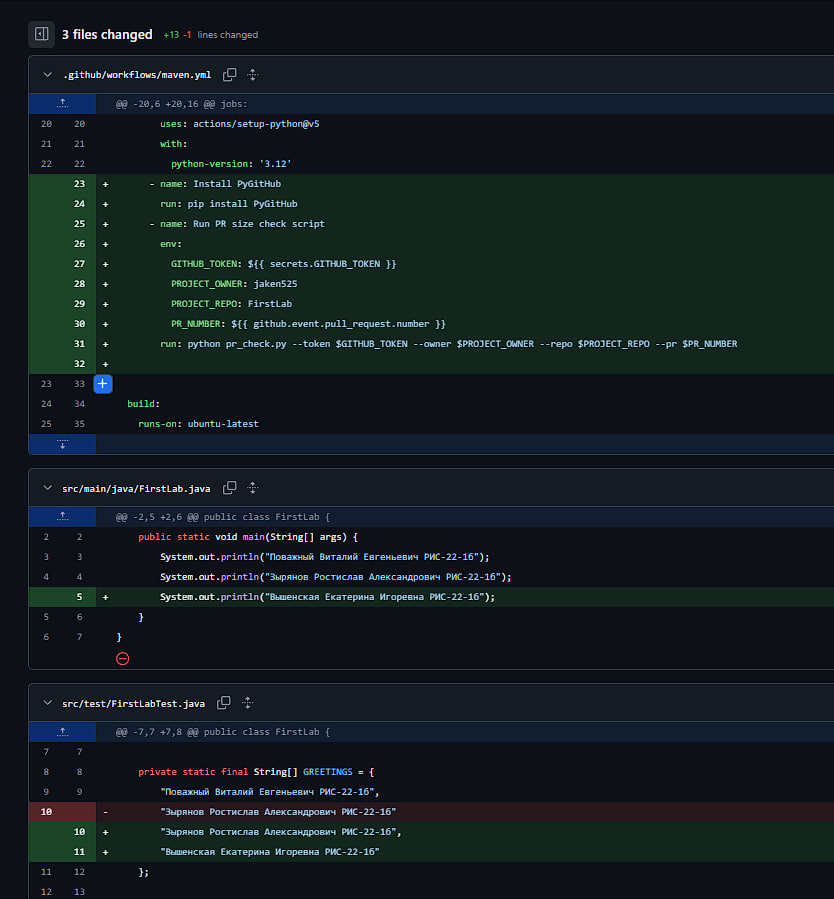

3. Создала и завершила пулл-реквест
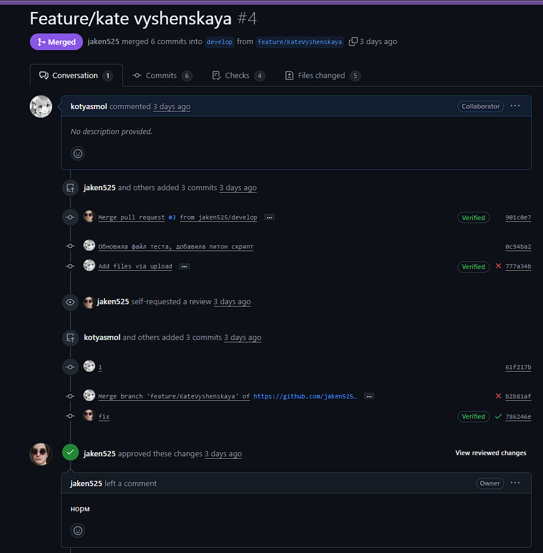
